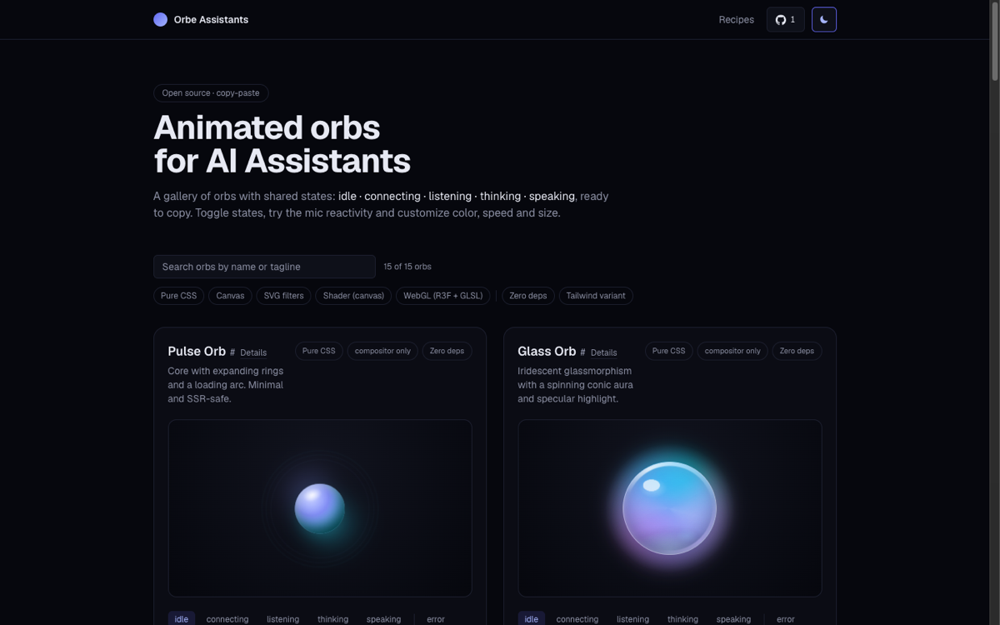

# Orbe Assistants

Copy-paste animated orbs for AI voice assistants. 15 audio-reactive React components sharing one 7-state contract: browse the gallery, copy the code or an AI prompt, wire it to your provider.

[](LICENSE)
[](https://orbe-assistants.vercel.app)
[](https://github.com/amunozdev/orbe-assistants)

<picture>
  <source media="(prefers-color-scheme: light)" srcset="docs/assets/hero-light.png">
  <source media="(prefers-color-scheme: dark)" srcset="docs/assets/hero-dark.png">
  
</picture>

## The orbs

| Orb | Tech | Tagline |
| --- | --- | --- |
| [Pulse Orb](https://orbe-assistants.vercel.app/orbs/pulse-orb) | Pure CSS | Core with expanding rings and a loading arc. Minimal and SSR-safe. |
| [Glass Orb](https://orbe-assistants.vercel.app/orbs/glass-orb) | Pure CSS | Iridescent glassmorphism with a spinning conic aura and specular highlight. |
| [Pixel Orb](https://orbe-assistants.vercel.app/orbs/pixel-orb) | Canvas | Pixel-art sphere on canvas: a grid that pulses and ripples with your voice. |
| [Particles Orb](https://orbe-assistants.vercel.app/orbs/particles-orb) | Canvas | Hundreds of particles form a rotating 3D sphere that breathes with your voice and scatters into a ring while connecting. |
| [Equalizer Orb](https://orbe-assistants.vercel.app/orbs/equalizer-orb) | Pure CSS | Equalizer bars inside a disc that react to the audio level. |
| [Aurora Orb](https://orbe-assistants.vercel.app/orbs/aurora-orb) | Pure CSS | Northern-lights veils that swirl and blur across a night sky. |
| [Halo Orb](https://orbe-assistants.vercel.app/orbs/halo-orb) | Pure CSS | A conic halo with orbital rings and a bright core that pulses. |
| [Gooey Orb](https://orbe-assistants.vercel.app/orbs/gooey-orb) | SVG filters | Liquid blob whose edges "boil" with SVG noise and displacement. |
| [Plasma Orb](https://orbe-assistants.vercel.app/orbs/plasma-orb) | Shader (canvas) | Shader mesh gradient on canvas, no Three.js. Organic distortion. |
| [Galaxy Orb](https://orbe-assistants.vercel.app/orbs/galaxy-orb) | Canvas | A glassy bubble holding a drifting starfield and nebula, with a specular glare and an iridescent, chromatic rim. |
| [Nebula Orb](https://orbe-assistants.vercel.app/orbs/nebula-orb) | WebGL (R3F + GLSL) | 3D sphere with simplex-noise displacement and fresnel. The "voice mode". |
| [Waveform Ring](https://orbe-assistants.vercel.app/orbs/waveform-ring) | Canvas | A ring whose radius traces the live waveform: time-domain audio drawn in polar coordinates. |
| [Edge Glow](https://orbe-assistants.vercel.app/orbs/edge-glow) | Pure CSS | Siri-style ambient frame: a masked conic-gradient glow that wraps your own content instead of sitting in the middle. |
| [Iridescent Flow](https://orbe-assistants.vercel.app/orbs/iridescent-flow) | Shader (canvas) | Single-pass fragment shader with flowing iridescent hues. Raw WebGL, zero dependencies. |
| [Liquid Metal](https://orbe-assistants.vercel.app/orbs/liquid-metal) | Shader (canvas) | Raymarched metaballs with a molten chrome finish. Raw WebGL, zero dependencies. |

## Features

- **7-state contract**: `idle`, `connecting`, `listening`, `thinking`, `speaking`, plus optional `error` and `disabled`. Same props on every orb.
- **Audio-reactive**: live amplitude via `levelRef` plus per-band analysis (bass / mid / treble) and raw waveform hooks.
- **Copy code or copy AI prompt**: every orb ships as plain files or as a self-contained prompt for Cursor, Copilot or Claude Code.
- **Provider recipes**: typed adapters for Vapi, ElevenLabs, LiveKit and OpenAI Realtime at [/recipes](https://orbe-assistants.vercel.app/recipes).
- **Per-orb docs pages**: props, files, dependencies and a live playground at `/orbs/<id>`.
- **Accessible**: `OrbStatus` live region announces state changes; every orb has a static reduced-motion fallback.
- **AI-agent friendly**: [llms.txt](https://orbe-assistants.vercel.app/llms.txt) and [llms-full.txt](https://orbe-assistants.vercel.app/llms-full.txt) expose the whole registry as plain text.
- **StackBlitz export**: open any orb as a runnable sandbox in one click.
- **Standalone example**: [`examples/voice-assistant`](examples/voice-assistant) wires an orb to a real mic lifecycle.
- **Tested**: shared hooks and state logic covered by a Vitest suite.

## Quick start

1. **Browse the gallery** at [orbe-assistants.vercel.app](https://orbe-assistants.vercel.app). Toggle states, try mic reactivity, tune color, speed and size live.
2. **Copy** the code (one tab per file, CSS Modules or Tailwind variants) or the AI prompt. Use the provider selector to include a typed adapter for Vapi, ElevenLabs, LiveKit or OpenAI Realtime.
3. **Wire it up**: drive `state` from your assistant lifecycle and pass a live level through `levelRef`.

```tsx
const [state, setState] = useState<OrbState>('idle');
const { levelRef } = useAudioLevel(state === 'listening');

return <PulseOrb state={state} levelRef={levelRef} colorFrom="#818cf8" colorTo="#22d3ee" />;
```

For a full runnable reference (connect, silence detection, thinking, speaking, mic errors) see [`examples/voice-assistant`](examples/voice-assistant).

## The contract

Every orb accepts the same `OrbProps`:

| Prop | Type | Default | Description |
| --- | --- | --- | --- |
| `state` | `OrbState` | `'idle'` | Assistant lifecycle state driving the animation. `error` and `disabled` are optional extensions. |
| `size` | `number` | 160-184 (per orb) | Diameter in pixels, also exposed as the `--orb-size` CSS variable. |
| `speed` | `number` | `1` | Animation speed multiplier, also exposed as `--orb-speed`. |
| `colorFrom` | `string` | per-orb gradient start | Gradient start color (any CSS color), exposed as `--orb-color-from`. |
| `colorTo` | `string` | per-orb gradient end | Gradient end color (any CSS color), exposed as `--orb-color-to`. |
| `levelRef` | `RefObject<number>` | `undefined` | Live audio amplitude in 0..1 read every frame without re-render; a negative value falls back to the procedural animation. |
| `label` | `string` | `'Assistant orb'` | Accessible name announced by screen readers via `aria-label`. |
| `className` | `string` | `undefined` | Extra class names merged onto the root element. |
| `ref` | `Ref<HTMLDivElement>` | `undefined` | React 19 ref to the root element. |

`OrbState` is `'idle' | 'connecting' | 'listening' | 'thinking' | 'speaking' | 'error' | 'disabled'`.

Customization also flows through public CSS variables, written on the root element every frame:

`--orb-size`, `--orb-speed`, `--orb-color-from`, `--orb-color-to`, `--orb-level`, `--orb-bass`, `--orb-mid`, `--orb-treble`

## Contributing

PRs welcome. See [CONTRIBUTING.md](CONTRIBUTING.md) for how to add an orb, run the gates and keep the contract intact.

## License

[MIT](LICENSE)

## Star history

[](https://star-history.com/#amunozdev/orbe-assistants&Date)
